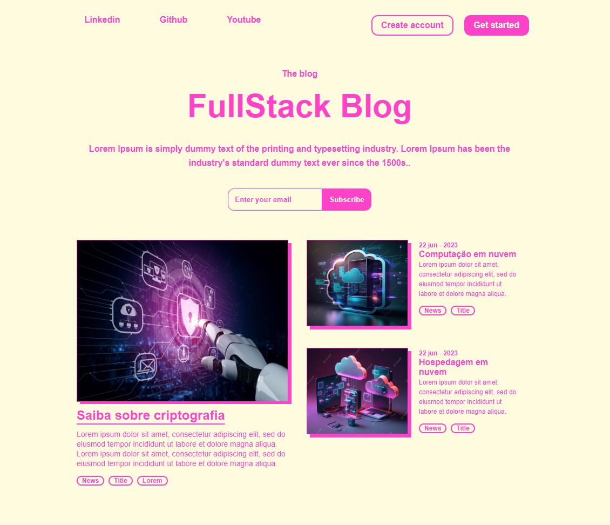
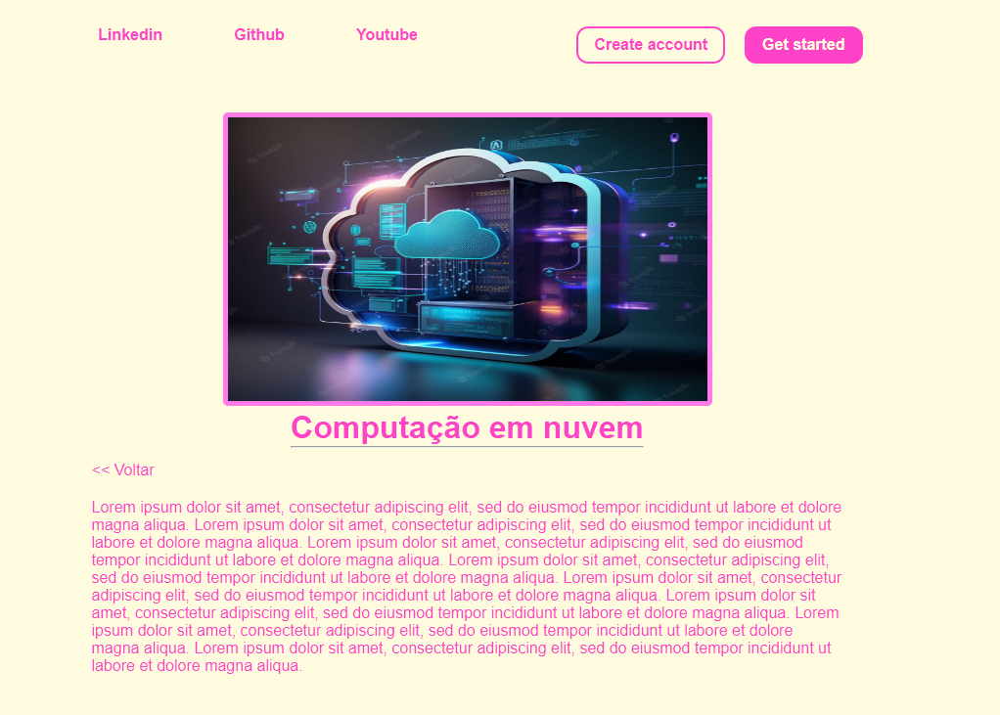

# FullStack Blog

Esse projeto foi criado durante o bootcamp 'Santander Bootcamp 2023 - Fullstack Java+Angular' 'como parte do desafio de projeto "Criando um blog com Angular".

O modelo do projeto foi baseado em um layout disponível no dribbled que você pode encontrar aqui: [Link do layout inspirado](https://dribbble.com/shots/20082537-Blog-home-page-Untitled-UI)

### Página inicial do blog:

 

### Página de conteúdo do blog:

 
